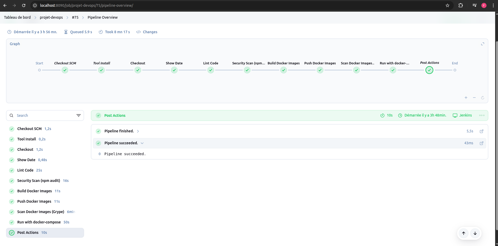

# Jenkins CI/CD Pipeline Project

This project demonstrates a complete CI/CD pipeline using **Jenkins** to automate the build, testing, security scanning, and deployment of a full-stack web application.

## 🔧 Technologies Used

- **Frontend**: React.js  
- **Backend**: Node.js (Express)  
- **Database**: MySQL  
- **Containerization**: Docker & Docker Compose  
- **CI/CD Tool**: Jenkins  

## ⚙️ Jenkins Pipeline Stages

The Jenkins pipeline, written in **Groovy**, includes the following stages:

1. **Checkout** – Clone source code from GitHub  
2. **Show Date** – Print build timestamp  
3. **Lint Code** – Run lint checks on backend and frontend  
4. **Security Scan (npm audit)** – Detect vulnerabilities in dependencies  
5. **Build Docker Images** – Build backend and frontend Docker images  
6. **Push Docker Images** – Push images to Docker Hub  
7. **Scan Docker Images (Grype)** – Scan images for vulnerabilities  
8. **Deploy** – Launch services using `docker-compose`

## 🌐 Webhook & Ngrok Integration

Using **Groovy**, this project implements a continuous integration workflow that triggers automatically whenever a push is detected in the GitHub repository via:

- A **GitHub webhook** configured to notify Jenkins on code changes  
- **Ngrok** used to expose the local Jenkins server publicly and securely  

This setup allows real-time automated builds .

## 🐳 Docker Services

The application runs in Docker containers managed by Docker Compose:

- `db`: MySQL database  
- `app-backend`: Node.js API  
- `app-frontend`: React.js frontend served with `serve`

## 🔐 Security Integration

Security is integrated into the pipeline using:

- `npm audit` to check Node.js dependencies  
- `Grype` to scan Docker images for known vulnerabilities  

## 🚀 How It Works

When a build is triggered:

- Jenkins pulls the latest source code  
- Lints and scans the code  
- Builds and scans Docker images  
- Pushes images to Docker Hub  
- Deploys the application stack using Docker Compose  

## ✅ Benefits

- Fully automated end-to-end CI/CD pipeline  
- Integrated code quality and security checks  
- Real-time feedback on every commit  
- Scalable and customizable for learning or production  

## 📸 Pipeline Result

Below is a screenshot showing a successful Jenkins pipeline run:

---

Feel free to fork, contribute, or adapt this project for your needs!
